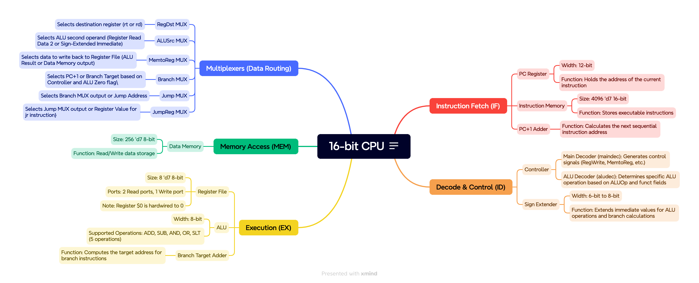
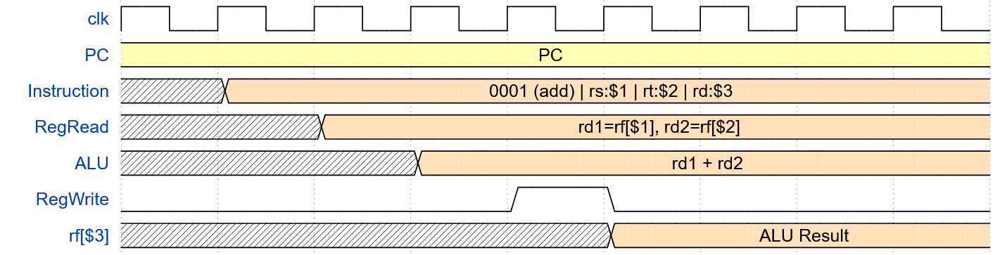
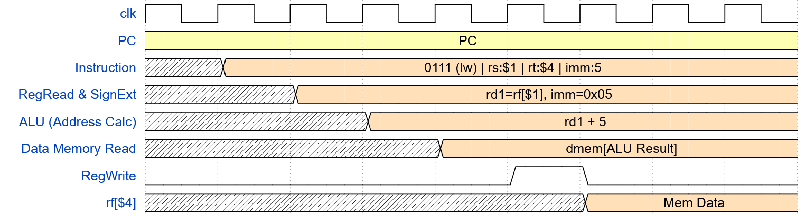
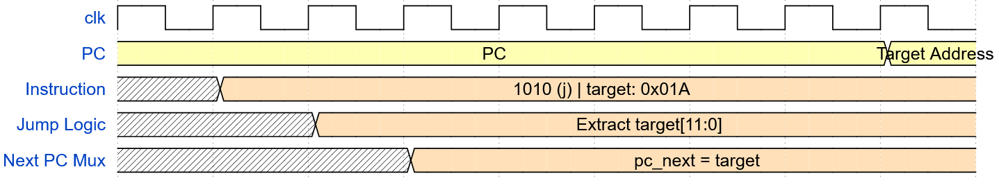

# 16-bit MIPS Single-Cycle Processor

## 1. Design
This is a single-cycle RISC processor inspired by MIPS, scaled to a 16-bit instruction width with an 8-bit datapath. The processor supports three distinct instruction formats (R-Type, I-Type, and J-Type) across a 12-instruction ISA. The system utilizes a Harvard architecture with fully separated instruction and data memories to allow simultaneous instruction fetching and data access.

## 2. Design Diagram

> **Figure 1:** CPU Architecture.

## 3. Timing Diagrams

> **Figure 2:** Demonstrates the synchronous fetch, asynchronous register read, combinational ALU execution, and synchronous register write on the following clock edge.

### I-Type Timing Diagram
*(Instruction Example: `lw $4, 5($1)`)*

> **Figure 3:** Demonstrates the critical path: Instruction Fetch -> Register Read -> Sign-Extended ALU Addition (Address calculation) -> Data Memory Read -> Register Write.

### J-Type Timing Diagram
*(Instruction Example: `j target`)*

> **Figure 4:** Demonstrates the immediate overwrite of the Program Counter with the 12-bit target address, bypassing the ALU and memory stages.

## 4. Instructions to Successfully Demo

A video demo is provided [here](https://youtu.be/wpnADr3U8i4).

```
make assemble_prog3
make run
```